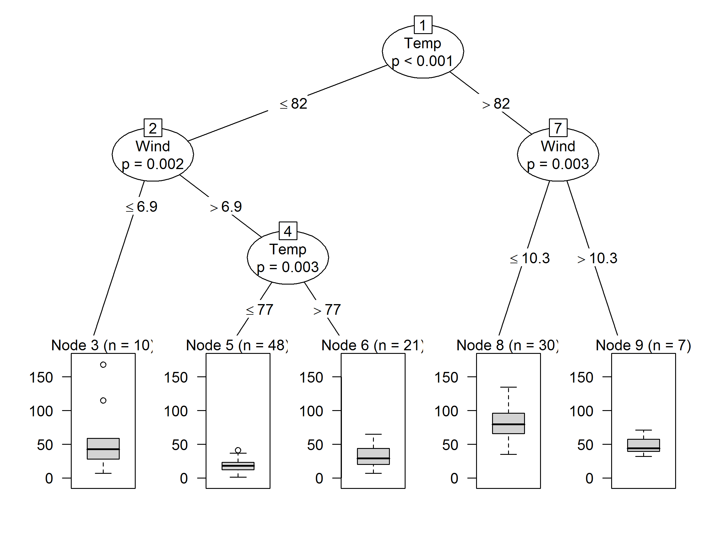

# ggCtree: A better regression ctree plot using ggplot2 

```{r}
#install.packages(c("tidyverse","partykit","data.tree","igraph","caret","ggthemes"))

```

## Example: 

```{r}
library(partykit)

# air quality dataset
airq <- subset(airquality, !is.na(Ozone))

# fit regression tree 
airct <- ctree(Ozone ~ ., data = airq)

# Standard plot from partykit package
plot(airct)

```



```{r}
# A better cTree regression plot

source("ggCtreeReg.R")

ggCtreeReg(airct, "(ppb)")

```


